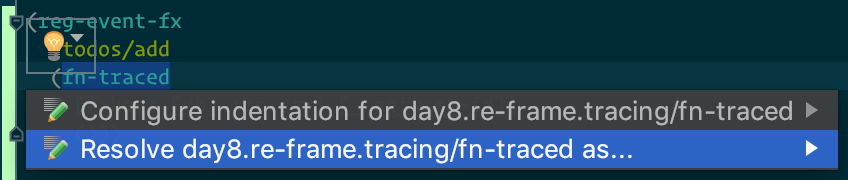
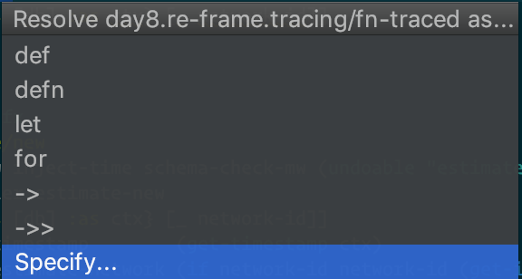
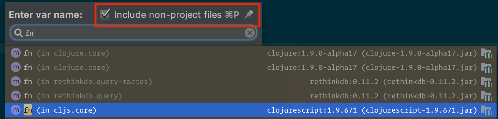

[](https://github.com/day8/re-frame-debux/actions?workflow=ci)
[](https://github.com/day8/re-frame-debux/tags)
[](https://clojars.org/re-frame/lein-template)
[](https://github.com/day8/re-frame-debux/issues)
[](https://github.com/day8/re-frame-debux/pulls)
[](https://github.com/day8/re-frame-debux/blob/master/LICENSE)

# re-frame-debux

[debux](https://github.com/philoskim/debux) is [@philoskim's](https://github.com/philoskim) useful and novel library for tracing Clojure and ClojureScript code, form by form.

This library, **re-frame-debux**, is a fork of **debux**, that repurposes it for tracing the ClojureScipt code in re-frame event handlers, for later inspection within [re-frame-10x](https://github.com/Day8/re-frame-10x).

This fork contains a few substantial extension/modifications to debux and, longer term, we would like to investigate merging them back into mainline debux, but the changes we needed to make required quite deep surgery, so in the interests of time, and getting a proof of concept out the door, we started off with a fork.

## Show Me

Here's what the trace looks like in `re-frame-10x`:


## Status

Already useful!! But it is still a work in progress and there'll likely be little annoyances and bugs, perhaps even big ones.

As always, if you run into any issues, please open an issue and we can try and help. We are also looking for collaborators on this interesting project. There's so much potential. (Beware, zippers and macros lurk).

Sharp edges include:
  - Operations like `map` or `for` operating on big sequences will generate too much trace.  That will be a problem within `re-frame-10x`. Don't enable tracing for event handlers which have that sort of processing. Not yet. [See issue #6](https://github.com/Day8/re-frame-debux/issues/6)
  - `condp` is not yet handled very elegently.

## Prerequisites

* clojure 1.8.0 or later
* clojurescript 1.9.854 or later


## How to use

`re-frame-debux` provides two macros:

* `fn-traced`  (use instead of `fn`)
* `defn-traced`  (use instead of `defn`)

Use them like this when registering event handlers:

```clojure
(ns my.app
  (:require [day8.re-frame.tracing :refer-macros [fn-traced defn-traced]]))

(re-frame.core/reg-event-db
  :some-event
  (fn-traced [db event]     ;; <--- use `fn-traced` instead of `fn`
     ; ... code in here to be traced
     ))
```

or:

```clojure
(defn-traced my-handler   ;; <--- use `defn-traced` instead of `defn`
  [coeffect event]
  ;; ... code in here to be traced
  )

(re-frame.core/reg-event-fx
   :some-event
   my-handler)
```

## Two libraries

**In development,** you want to include the `day8.re-frame/tracing` library. When you use a `day8.re-frame.tracing/fn-traced` or `day8.re-frame.tracing/traced-defn` from this library, it will emit traces to re-frame's tracing system, which can then be consumed by [re-frame-10x](https://github.com/Day8/re-frame-10x).

**In production,** you want to include the `day8.re-frame/tracing-stubs` library. This has the same public API as `tracing` (`day8.re-frame.tracing/fn-traced`, `day8.re-frame.tracing/traced-defn`), but the macros simply delegate to the core `fn` and `defn` macros.

With this setup, your use of both macros will have zero runtime and compile time cost in production builds, and are able to be turned off at dev time too via the Closure define.  This ensures that you can leave your code instrumented at all times, but not pay any costs in production.

### Why two libraries?

It is technically possible to use the `day8.re-frame/tracing` library in your production builds. Under advanced compilation, the Closure define should ensure that dead code elimination (DCE) works to remove the traced version of the function from your final JS file. We verified that the traced function JS was removed, but had concerns that other required namespaces may not be completely dead code eliminated. Have a tracing-stubs makes it impossible for DCE to fail, because there is no dead code to be eliminated.

## Installation

**First, please be sure to read the "Two libraries" section immediately above for background.**

To include *re-frame-debux* in your project, simply add the following to your *project.clj* development dependencies:

```
[day8.re-frame/tracing "0.5.1"]
```

and this to your production dependencies (make sure they are production only):

```
[day8.re-frame/tracing-stubs "0.5.1"]
```

Add Closure defines to your config to enable re-frame tracing + the function tracing:

```
:cljsbuild    {:builds {:client {:compiler {:closure-defines {"re_frame.trace.trace_enabled_QMARK_" true
                                                              "day8.re_frame.tracing.trace_enabled_QMARK_"  true}}}}}}
```


## Resolving macros with Cursive

You can instruct [Cursive](https://cursive-ide.com) to treat the `fn-traced` and `defn-traced` macros like their standard `fn` and `defn` counterparts by [customising symbol resolution](https://cursive-ide.com/userguide/macros.html).








## License
Copyright © 2015--2018 Young Tae Kim, 2018 Day 8 Technology

Distributed under the Eclipse Public License either version 1.0 or any later version.
