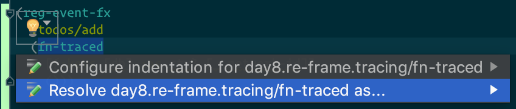
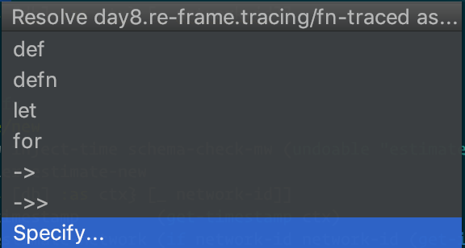
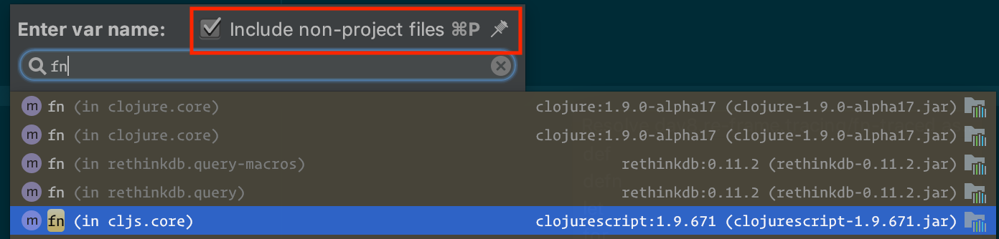

<!-- [](https://github.com/day8/re-frame-debux/actions?workflow=ci)
[](https://github.com/day8/re-frame-debux/actions?workflow=cd)
[](https://github.com/day8/re-frame-debux/tags) 
[](https://github.com/day8/re-frame-debux/pulls)

-->
[](https://clojars.org/day8.re-frame/tracing)
[](https://github.com/day8/re-frame-debux/issues)
[](https://github.com/day8/re-frame-debux/blob/master/LICENSE)

# re-frame-debux

[debux](https://github.com/philoskim/debux) is [@philoskim's](https://github.com/philoskim) useful and novel library for tracing Clojure and ClojureScript code, form by form.

This library, **re-frame-debux**, is a fork of **debux**, that repurposes it for tracing the ClojureScipt code in re-frame event handlers, for later inspection within [re-frame-10x](https://github.com/Day8/re-frame-10x).

This fork contains a few substantial extension/modifications to debux and, longer term, we would like to investigate merging them back into mainline debux, but the changes we needed to make required quite deep surgery, so in the interests of time, and getting a proof of concept out the door, we started off with a fork.

## Show Me

Here's what the trace looks like in `re-frame-10x`:


## Status

Already useful!! But it is still a work in progress and there'll likely be little annoyances and bugs, perhaps even big ones.

As always, if you run into any issues, please open an issue and we can try and help. We are also looking for collaborators on this interesting project. There's so much potential. (Beware, zippers and macros lurk).

Sharp edges include:
  - Operations like `map` or `for` operating on big sequences will generate too much trace.  That will be a problem within `re-frame-10x`. Don't enable tracing for event handlers which have that sort of processing. Not yet. [See issue #6](https://github.com/Day8/re-frame-debux/issues/6)

## Prerequisites

* clojure 1.11.0 or later
* clojurescript 1.11.0 or later


## How to use

`re-frame-debux` provides two macros:

* `fn-traced`  (use instead of `fn`)
* `defn-traced`  (use instead of `defn`)

Use them like this when registering event handlers:

```clojure
(ns my.app
  (:require [day8.re-frame.tracing :refer-macros [fn-traced defn-traced]]))

(re-frame.core/reg-event-db
  :some-event
  (fn-traced [db event]     ;; <--- use `fn-traced` instead of `fn`
     ; ... code in here to be traced
     ))
```

or:

```clojure
(defn-traced my-handler   ;; <--- use `defn-traced` instead of `defn`
  [coeffect event]
  ;; ... code in here to be traced
  )

(re-frame.core/reg-event-fx
   :some-event
   my-handler)
```

## Tracing options

Both `fn-traced` and `defn-traced` accept an optional opts map immediately after the macro name. The opts modulate what gets emitted on every per-form `:code` trace record.

```clojure
(fn-traced {:locals true :once true} [db [_ x]]
  ;; ...body...
  )

(defn-traced {:msg "checkout-handler" :final true}
  checkout
  [db [_ amount]]
  ;; ...body...
  )
```

| Opt                     | Effect                                                                                                                                                              |
|-------------------------|---------------------------------------------------------------------------------------------------------------------------------------------------------------------|
| `:locals true`          | Attach the captured handler args as `[[sym val] ...]` to each `:code` entry. Lets you see the binding values that fed the trace.                                    |
| `:if pred`              | Runtime predicate called with the per-form result; `send-trace!` fires only when `(pred result)` returns truthy.                                                    |
| `:once true` (`:o`)     | Suppress consecutive emissions whose `(form, result)` pair matches the previous one. Per call site; state survives across handler invocations until the result actually changes. Useful for high-frequency dispatches. |
| `:verbose true` (`:show-all`) | Wrap leaf literals (numbers, strings, booleans, keywords, chars, nil) that the default mode skips for noise reduction. Special-form skips (`recur`, `throw`, `var`, `quote`, …) stay honoured.                          |
| `:final true` (`:f`)    | Emit only the outermost (indent-level 0) `:code` entry per top-level wrapping form. Suppresses every nested per-form entry — useful when only the final value matters.                                                  |
| `:msg "label"` (`:m`)   | Attach a developer-supplied label to each emitted `:code` entry. Per-call dynamic — evaluated at trace time, not macroexpansion. Lets consumers distinguish output from many parallel call sites.                       |

The same opt set applies to `dbg`, `dbgn`, `dbg-last`, `fx-traced`, `defn-fx-traced` (with minor per-macro variations called out in their docstrings).

## Single-form tracing: `dbg` / `dbg-last` / `dbgn`

For one-off probes inside a handler body — without rewriting the whole `fn` as `fn-traced`:

```clojure
(re-frame.core/reg-event-db
  :user/login
  (fn [db [_ creds]]
    (assoc db :user (dbg (lookup-user creds) {:name "login"}))))
```

`dbg` is value-transparent: the wrapped expression evaluates exactly as if the macro weren't there, and one trace record per evaluation lands on the active event's `:code` stream. Outside any trace context, output falls back to `tap>` so REPL callers still see the value.

`dbg-last` is the thread-last counterpart — drops into a `->>` step slot:

```clojure
(->> coll
     (filter pred?)
     dbg-last                          ; bare
     (map xf)
     (reduce +))

(->> coll
     (filter pred?)
     (dbg-last {:name "after-filter"}) ; with opts
     (map xf))
```

`dbgn` traces every nested sub-form of an expression (the `dbgn` zipper walker), as opposed to `dbg`'s single record per evaluation:

```clojure
(dbgn (->> users
           (filter active?)
           (map :email)
           sort))
;; => emits one :code record per intermediate step
```

All three macros take the same opts map as `fn-traced` (`:name`, `:locals`, `:if`, `:once`, `:msg`, plus `:tap?` for `dbg`/`dbg-last`).

## Tracing `reg-event-fx` handlers: `fx-traced` / `defn-fx-traced`

`reg-event-fx` handlers return an effects map — `fn-traced` traces the inner expressions but doesn't surface the per-key entries of the returned map. `fx-traced` does both: it inherits all of `fn-traced`'s per-form `:code` emission plus emits one `:fx-effects` entry per key in the returned effect-map.

```clojure
(re-frame.core/reg-event-fx
  :checkout
  (fx-traced [_ [_ amount]]
    (let [taxed (* 1.1 amount)]
      {:db       {:total taxed}
       :http     {:method :post :body taxed}
       :dispatch [:notify :checkout-done]})))
```

`defn-fx-traced` is the `defn` variant — same surface as `defn-traced` plus the per-effect-key tracing. Same opts as `fn-traced` (`:locals`, `:if`, `:once`, `:verbose`, `:final`, `:msg`).

## Runtime API: on-demand wrap / unwrap

The compile-time macros above require a source edit. For tools that drive re-frame from the REPL — re-frame-pair in particular — `day8.re-frame.tracing.runtime` exposes a wrap/unwrap cycle that swaps a `fn-traced`-wrapped version of a handler in and out of re-frame's registrar without source edits:

```clojure
(require '[day8.re-frame.tracing.runtime :as rt])

(rt/wrap-handler! :event :some/event
  (fn [db [_ x]]
    (let [n (* 2 x)]
      (assoc db :n n))))

;; ... dispatch / observe the :code stream ...

(rt/unwrap-handler! :event :some/event)   ; restore the original
```

`wrap-handler!` captures the original handler as currently registered (with whatever interceptor chain) into a side-table; `unwrap-handler!` restores verbatim — bypassing `reg-event-db`'s chain builder so nested interceptors come back intact.

The replacement form must be a literal `(fn [...] ...)` — `fn-traced` operates on the AST at compile time, so a precompiled fn value can't be re-traced.

Convenience wrappers:

| Macro / fn                               | Notes                                                                                                                  |
|------------------------------------------|------------------------------------------------------------------------------------------------------------------------|
| `wrap-event-fx!` / `wrap-event-ctx!`     | Use these instead of `wrap-handler! :event` when the traced body returns an effects map / context map.                 |
| `wrap-sub!` / `wrap-fx!`                 | Convenience for `wrap-handler! :sub` / `wrap-handler! :fx`; `wrap-sub!` accepts layer-2, signal-fn, and `:<-` shapes. |
| `unwrap-sub!` / `unwrap-fx!` / `unwrap-all!` | Restore one or all wrapped handlers.                                                                              |
| `wrapped?` / `wrapped-list`              | Inspect the side-table — useful for tools badging the wrapped state in their UI.                                       |
| `runtime-api?`                           | Feature-detection predicate: `true` when this namespace is loaded. Stable hook for downstream tools.                   |

## Configuration

Four runtime knobs live alongside the tracing macros and apply globally:

```clojure
(require '[day8.re-frame.tracing :as t])

(t/set-tap-output! true)          ; mirror every send-trace! payload through tap> as well
(t/set-trace-frames-output! true) ; opt into :trace-frames entry/exit markers
(t/set-print-seq-length! 50)      ; bound the number of items shown for sequences in trace records
(t/reset-indent-level!)           ; reset the trace-indenting counter (recovery if a body threw mid-emit)
```

`set-tap-output!` is the toggle for the `tap>` output channel added in v0.7 — see CHANGELOG for the per-call `:tap?` opt that does the same thing on a single `dbg` site without flipping the global.
`:trace-frames` is off by default; enable `set-trace-frames-output!` only for tools that need function entry/exit boundaries.

## Option 1: Two libraries

**In development,** you want to include the `day8.re-frame/tracing` library. When you use a `day8.re-frame.tracing/fn-traced` or `day8.re-frame.tracing/traced-defn` from this library, it will emit traces to re-frame's tracing system, which can then be consumed by [re-frame-10x](https://github.com/Day8/re-frame-10x).

**In production,** you want to include the `day8.re-frame/tracing-stubs` library. This has the same public API as `tracing` (`day8.re-frame.tracing/fn-traced`, `day8.re-frame.tracing/traced-defn`), but the macros simply delegate to the core `fn` and `defn` macros.

With this setup, your use of both macros will have zero runtime and compile time cost in production builds, and are able to be turned off at dev time too via the Closure define.  This ensures that you can leave your code instrumented at all times, but not pay any costs in production.

### Why two libraries?

It is technically possible to use the `day8.re-frame/tracing` library in your production builds. Under advanced compilation, the Closure define should ensure that dead code elimination (DCE) works to remove the traced version of the function from your final JS file. We verified that the traced function JS was removed, but had concerns that other required namespaces may not be completely dead code eliminated. Have a tracing-stubs makes it impossible for DCE to fail, because there is no dead code to be eliminated.

## Option 1: Installation

**First, please be sure to read the "Two libraries" section immediately above for background.**

To include *re-frame-debux* in your project, simply add the following to your *project.clj* development dependencies:

```
[day8.re-frame/tracing "0.6.0"]
```

and this to your production dependencies (make sure they are production only):

```
[day8.re-frame/tracing-stubs "0.6.0"]
```

Add Closure defines to your config to enable re-frame tracing + the function tracing:

```
:cljsbuild    {:builds {:client {:compiler {:closure-defines {"re_frame.trace.trace_enabled_QMARK_" true
                                                              "day8.re_frame.tracing.trace_enabled_QMARK_"  true}}}}}}
```


## Option 2: Namespace Aliases with shadow-cljs

Requires version 0.5.5 or greater.

The `day8.re-frame.tracing-stubs` ns is also available in the main package so
that if you are using shadow-cljs use `:ns-aliases` in a shadow-cljs build
config to achieve the same result as option 1:

```clojure
{:builds
 {:app
  {:target :browser
   ...
   :release
   {:build-options
    {:ns-aliases
     {day8.re-frame.tracing day8.re-frame.tracing-stubs}}}}}

```

This redirects every `(:require [day8.re-frame.tracing :as x])` to use the
stubs instead in a release build and the development build just uses the
regular code.

## Resolving macros with Cursive

You can instruct [Cursive](https://cursive-ide.com) to treat the `fn-traced` and `defn-traced` macros like their standard `fn` and `defn` counterparts by [customising symbol resolution](https://cursive-ide.com/userguide/macros.html).








## Testing

The canonical test entry-point is `bb test`, which compiles the
`browser-test` shadow-cljs build and runs it via
[day8.chrome-shadow-test-runner](https://github.com/day8/re-frame-test).
Both the Clojure-side macroexpansion tests and the ClojureScript
integration tests run in the same suite.

```
bb test
```

For interactive development:

```
bb watch-test           # rebuilds + reruns on file change
```

The legacy `lein test` path is still functional for one release
cycle as a transition shim — `lein test` runs the Clojure-side
suite only. New contributors should prefer `bb test`.

## Releasing

Two artefacts ship from this repo independently:

```
bb clojars              # day8.re-frame/tracing
bb clojars-stubs        # day8.re-frame/tracing-stubs (from ./tracing-stubs/)
```

CI ([continuous-integration-workflow.yml](.github/workflows/continuous-integration-workflow.yml))
runs `bb test` on every push; CD
([continuous-deployment-workflow.yml](.github/workflows/continuous-deployment-workflow.yml))
runs both clojars tasks on a `v*` tag.

## License
Copyright © 2015--2018 Young Tae Kim, 2018 Day 8 Technology

Distributed under the Eclipse Public License either version 1.0 or any later version.
